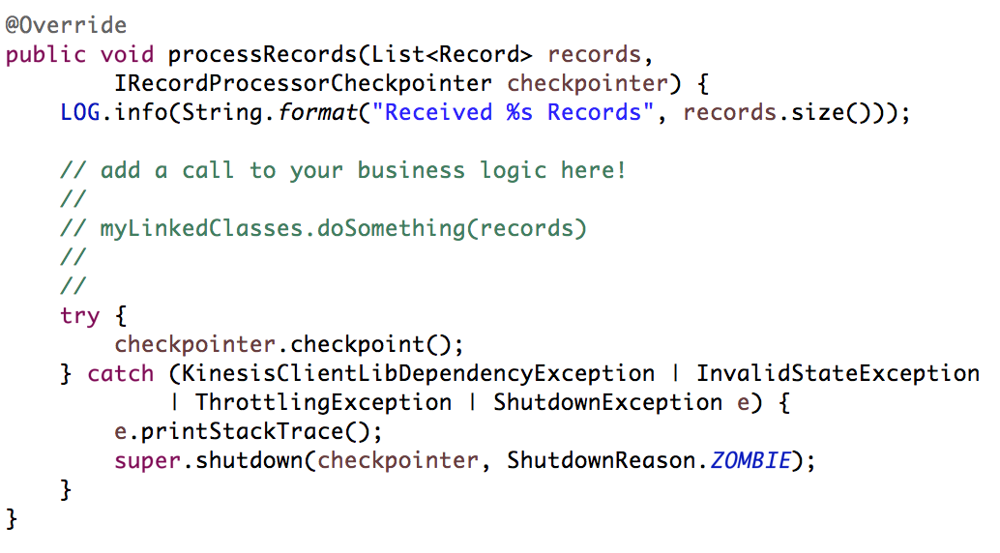

# Amazon Kinesis Elastic Beanstalk Managed Consumer

Amazon Kinesis provides a scalable and highly available platform for ingesting data from thousands of clients. Once data is available on a Kinesis stream, you can build applications to process the data using the [Amazon Kinesis Client Library (KCL)](http://docs.aws.amazon.com/streams/latest/dev/developing-consumers-with-kcl.html). KCL provides a framework for managing many of the complexities that accompany designing stream-processing applications. For example, the KCL will automatically distribute workers to process each shard in a Kinesis stream. It will manage this in a single JVM or across a fleet of instances. Using the KCL, you can build elastic, fault-tolerant, scalable stream-processing applications. Once you’ve built such an application, you’ll want a simple way to deploy it.

[AWS Elastic Beanstalk (Tomcat)](http://docs.aws.amazon.com/elasticbeanstalk/latest/dg/java-tomcat-platform.html) is an easy-to-use service for deploying and scaling java based web applications and services. Simply upload your application archive, and AWS Elastic Beanstalk automatically deploys it across multiple Availability Zones with configuration of AutoScaling. It also provides load balancing and monitors application health. These features make AWS Elastic Beanstalk a great platform for running Amazon Kinesis Applications.

This module provides a java codebase which will significantly decrease the complexity of building an application based on the KCL. With KCL, you simply implement an interface, and then start a `Worker`. KCL ensures that your code is run on a dedicated Thread that is consuming data from a single Shard. Furthermore, by managing leases in Amazon DynamoDB, it allows you to run a large number of Workers on one or more machines, while ensuring that only 1 Thread in the fleet is processing Shard data at a given time.

Building KCL Applications typically requires that you build an `IRecordProcessor` instance, and an `IRecordProcessorFactory` instance which creates new record processors. You then have to build a consumer module that provides credentials so it can connect to Kinesis, configures the Worker, and then starts processing.

With the Amazon Kinesis Elastic Beanstalk Managed Consumer, you only have 1 job to do as a programmer. You must *effectively* implement the IRecordProcessor by extending a `ManagedClientProcessor` class. This class has all the smarts about how to commit changes to the Application's progress, how to startup and shutdown, and so on. This allows you to focus on wiring in the business logic for your application, and not worry how it gets started up and maintained over time. Furthermore, rather than you having to figure out how to run the `Worker` instance on multiple machines, this module provides integration with Elastic Beanstalk. By including this module as a dependency, and the building with Maven, this module will generate a deployable WAR for Apache Tomcat that can be dropped into Elastic Beanstalk. AWS will then handle starting your Kinesis Workers and ensuring that they are automatically scaled based on processing demand.

This project also gives you the ability to easily work with Kinesis records that are encrypted with the [AWS Key Management Services (KMS)](https://aws.amazon.com/kms). By providing a KMS Key ARN and optionally an Encryption Context, the `ManagedConsumer` will automatically decrypt data before it is supplied to your record processor.

## Getting Started

To get started with this project, just create a fork from Github. You'll see a `com.amazonaws.services.kinesis` package which contains all the managed code, which you are welcome to look at but are not required to change. You'll also see a default package which contains the `MyRecordProcessor` class. This can be renamed and moved as you like. If nothing else, you need to add your code to this bit of the `processRecords()` method:



There's also a really important detail - when the KCL runs your application, in runs a separate `ManagedClientProcessor` instance in a Thread per Shard of the Stream. Because of this, we need a simple way to create new instances of `MyRecordProcessor`, and we've decided to use a `copy()` constructor. This is a method within `MyRecordProcessor` that knows how to create new instances of itself. The provided implementation just calls the `MyClientProcessor` constructor:

```	
@Override
public ManagedClientProcessor copy() throws Exception {
	return new MyRecordProcessor();
}
```

However, if your `MyRecordProcessor` class has local state variables which must be configured on instance initialisation, then it is recommended that you provide these as Constructor arguments. For (hopefully) obvious reasons, using `static` variables is probably a really bad idea here, but if you know what you are doing then go ahead.


## Running the application

Once you have wired in your business logic and want to start testing, simply install [Apache Maven](https://maven.apache.org), the tool we've decided to use to build this module. Once done, you can run the command `mvn war:war`, and Maven will build a distribution artefact that you can deploy to Apache Tomcat. This project will automatically have exposed a `listener-class` in the provided `web.xml` which uses a ServletInitiator thread to start your app. Elastic Beanstalk will do all the clever stuff to keep your app running, and to restart hosts should they crash, etc.